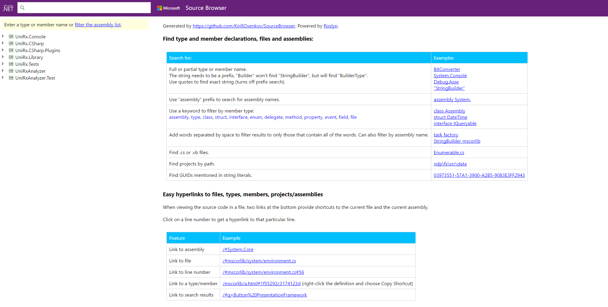
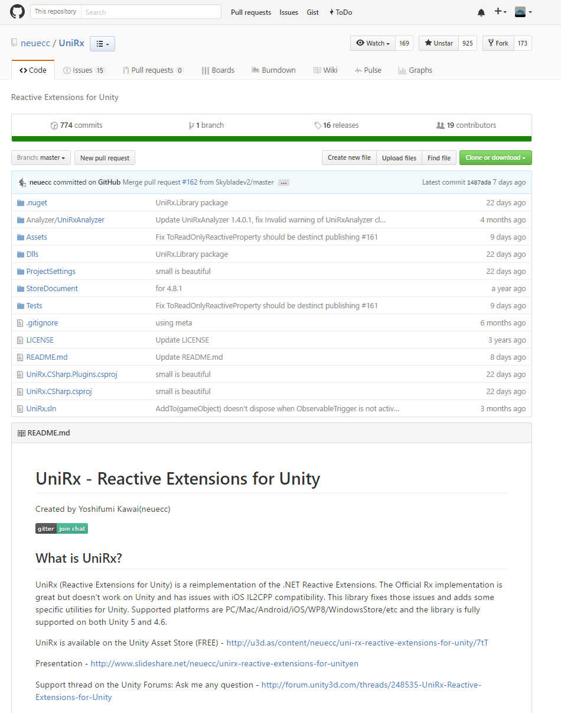

[UniRx ReferenceSource](https://unitx-referencesource.azurewebsites.net/)
----

Is available on AzureWebApps

Powered by Roslyn, using https://github.com/KirillOsenkov/SourceBrowser

Original Source Code
----

Reative Extensions for Unity, provided by neuecc.

https://github.com/neuecc/UniRx

